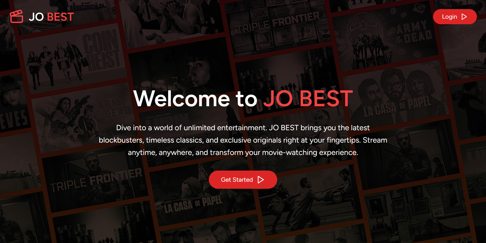
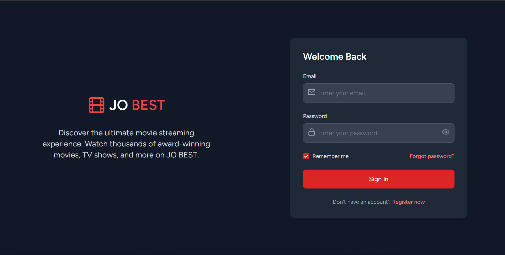
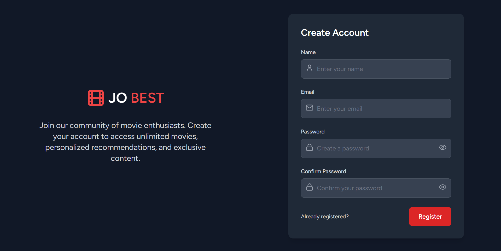
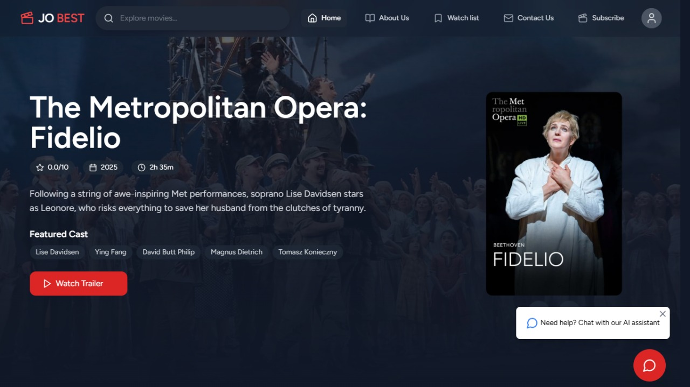
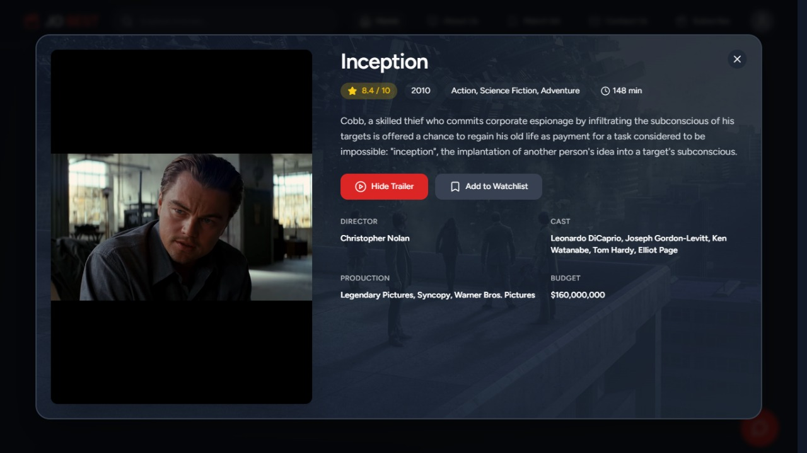
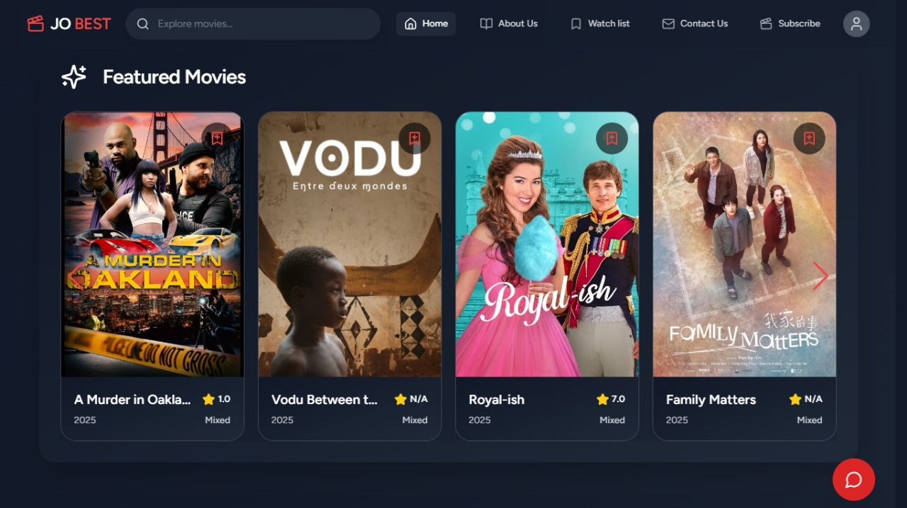
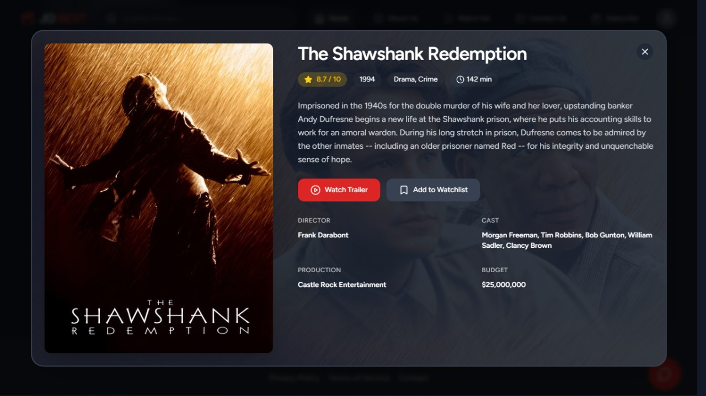
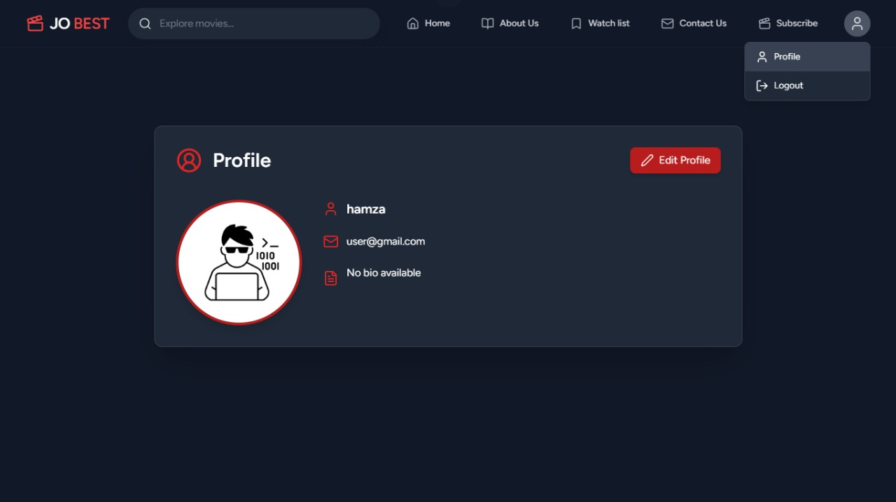

<div align="center">

# 🎬 JO BEST 🎬

### *Your Ultimate Cinematic Companion*

[](https://laravel.com)
[](https://reactjs.org)
[](https://php.net)
[](https://tailwindcss.com)
[](https://mysql.com)


[🚀 Demo](https://your-demo-link.com) • [📖 Documentation](https://your-docs-link.com) • [🐛 Report Bug](https://github.com/hamzatal/JoBest-Movie/issues) • [✨ Request Feature](https://github.com/hamzatal/JoBest-Movie/issues)

---

</div>

## 📸 Showcase

<div align="center">

### 🎭 Welcome Screen


### 🔐 Authentication
<table>
  <tr>
    <td></td>
    <td></td>
  </tr>
</table>

### 🎥 Application Screenshots
<table>
  <tr>
    <td></td>
    <td></td>
  </tr>
  <tr>
    <td></td>
    <td></td>
  </tr>
  <tr>
    <td colspan="2" align="center"></td>
  </tr>
</table>

</div>

---

## ✨ Features

<table>
  <tr>
    <td align="center" width="33%">
      
      <h3>🔒 Secure Authentication</h3>
      <p>Built with Laravel Breeze for robust user authentication and authorization</p>
    </td>
    <td align="center" width="33%">
      
      <h3>❤️ Personalized Watchlists</h3>
      <p>Create and manage your custom movie collections effortlessly</p>
    </td>
    <td align="center" width="33%">
      
      <h3>🔍 Smart Discovery</h3>
      <p>Advanced filtering and search to find your perfect movie</p>
    </td>
  </tr>
  <tr>
    <td align="center" width="33%">
      
      <h3>📱 Responsive Design</h3>
      <p>Seamless experience across all devices and screen sizes</p>
    </td>
    <td align="center" width="33%">
      
      <h3>⚡ Lightning Fast</h3>
      <p>Optimized performance with modern web technologies</p>
    </td>
    <td align="center" width="33%">
      
      <h3>🗄️ Robust Backend</h3>
      <p>Powered by Eloquent ORM and MVC architecture</p>
    </td>
  </tr>
</table>

---

## 🛠️ Tech Stack

<div align="center">

| Category | Technologies |
|:--------:|:------------:|
| **Frontend** |    |
| **Backend** |   |
| **Database** |  |
| **Tools** |    |

</div>

---

## 🚀 Quick Start

### 📋 Prerequisites

Before you begin, ensure you have the following installed:

```bash
✅ PHP >= 8.1
✅ Composer
✅ Node.js >= 16.x
✅ MySQL >= 5.7
✅ Git
```

### 💻 Installation Steps

<details>
<summary><b>1️⃣ Clone the Repository</b></summary>

```bash
git clone https://github.com/hamzatal/JoBest-Movie.git
cd JoBest-Movie
```
</details>

<details>
<summary><b>2️⃣ Install PHP Dependencies</b></summary>

```bash
composer install
```
</details>

<details>
<summary><b>3️⃣ Install Node Dependencies</b></summary>

```bash
npm install
# or
yarn install
```
</details>

<details>
<summary><b>4️⃣ Environment Configuration</b></summary>

```bash
# Copy the environment file
cp .env.example .env

# Generate application key
php artisan key:generate

# Configure your database in .env file
DB_CONNECTION=mysql
DB_HOST=127.0.0.1
DB_PORT=3306
DB_DATABASE=movie_hub
DB_USERNAME=your_username
DB_PASSWORD=your_password
```
</details>

<details>
<summary><b>5️⃣ Database Setup</b></summary>

```bash
# Create database
mysql -u root -p
CREATE DATABASE movie_hub;
exit;

# Run migrations
php artisan migrate

# Seed the database (optional)
php artisan db:seed
```
</details>

<details>
<summary><b>6️⃣ Launch Application</b></summary>

```bash
# Terminal 1 - Start Vite dev server
npm run dev

# Terminal 2 - Start Laravel server
php artisan serve
```

🎉 **Your application is now running!**
- Frontend: `http://localhost:5173`
- Backend: `http://localhost:8000`

</details>

---

## 📁 Project Structure

```
movie-hub/
│
├── 📂 app/                    # Core application logic
│   ├── Http/                  # Controllers & Middleware
│   ├── Models/                # Eloquent models
│   └── Services/              # Business logic
│
├── 📂 config/                 # Configuration files
│
├── 📂 database/               # Database files
│   ├── migrations/            # Database migrations
│   ├── seeders/               # Database seeders
│   └── factories/             # Model factories
│
├── 📂 public/                 # Public assets
│   ├── css/                   # Compiled CSS
│   ├── js/                    # Compiled JavaScript
│   └── github-images/         # README images
│
├── 📂 resources/              # Raw assets
│   ├── css/                   # Source CSS
│   ├── js/                    # React components
│   └── views/                 # Blade templates
│
├── 📂 routes/                 # Application routes
│   ├── web.php               # Web routes
│   └── api.php               # API routes
│
├── 📂 tests/                  # Automated tests
│   ├── Feature/              # Feature tests
│   └── Unit/                 # Unit tests
│
├── .env.example              # Environment template
├── composer.json             # PHP dependencies
├── package.json              # Node dependencies
└── README.md                 # You are here!
```

---

## 🎨 Color Palette

<div align="center">

| Color | Hex | Usage |
|:-----:|:---:|:-----:|
| 🔴 Primary | `#FF2D20` | Main brand color |
| 🔵 Secondary | `#61DAFB` | Accents & highlights |
| 🟣 Tertiary | `#777BB4` | Supporting elements |
| 🟢 Success | `#10B981` | Positive actions |
| 🟡 Warning | `#F59E0B` | Alerts |
| ⚫ Dark | `#1F2937` | Text & backgrounds |

</div>

---

## 🤝 Contributing

We love contributions! Here's how you can help:

<div align="center">

### 🌟 Ways to Contribute

| Type | Description |
|:----:|:------------|
| 🐛 **Bug Reports** | Found a bug? [Open an issue](https://github.com/hamzatal/JoBest-Movie/issues) |
| 💡 **Feature Requests** | Have an idea? [Share it with us](https://github.com/hamzatal/JoBest-Movie/issues) |
| 📝 **Documentation** | Improve our docs |
| 💻 **Code** | Submit a pull request |

</div>

### 📝 Contribution Process

1. **Fork** the repository
2. **Create** your feature branch
   ```bash
   git checkout -b feature/AmazingFeature
   ```
3. **Commit** your changes
   ```bash
   git commit -m '✨ Add some AmazingFeature'
   ```
4. **Push** to the branch
   ```bash
   git push origin feature/AmazingFeature
   ```
5. **Open** a Pull Request

---

## 📜 License

<div align="center">

Distributed under the **MIT License**. See `LICENSE` for more information.

[](https://opensource.org/licenses/MIT)

</div>

---

## 👨‍💻 Author

<div align="center">

### Hamza Taleb

[](https://github.com/hamzatal)
[](https://linkedin.com/in/yourprofile)
[](mailto:your.email@example.com)

</div>

---

## 🙏 Acknowledgments

<div align="center">

Special thanks to:
- Laravel community for the amazing framework
- React team for the powerful UI library
- All contributors who help improve this project
- You, for checking out JO BEST! ⭐

</div>

---

<div align="center">

### 💖 Show Your Support

If you find this project helpful, please consider giving it a ⭐!

[](https://github.com/hamzatal/JoBest-Movie)

---

**Made with ❤️ by Hamza Taleb**

*Happy Coding! 🚀*

</di
